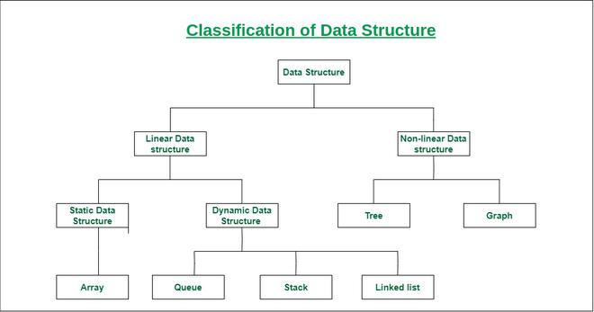
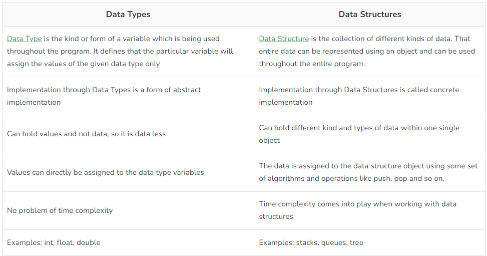
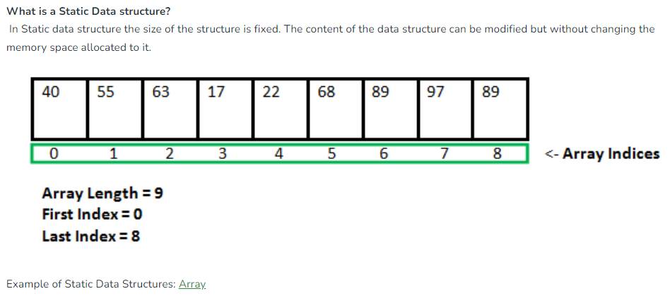
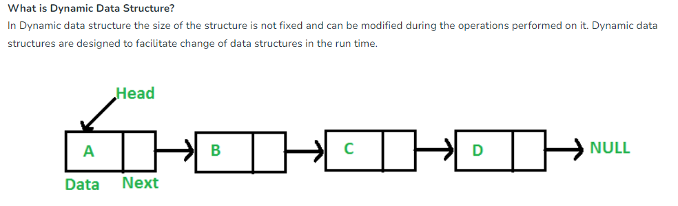

### DSA BASICS

1. ***What is Data structure ??***
* A data structure is a way of organizing and storing data in a computer so that it can be accessed and used efficiently. It refers to the logical or mathematical representation of data, as well as the implementation in a computer program.
* It is defined as a particular way of storing and organizing data.
* The main idea behind using data structures is to minimize the time and space complexities. 
*   An efficient data structure takes minimum memory space and requires minimum time to execute the data.

***Data structures can be classified into two broad categories:***


***Data type vs Data structure***


***Static Data Structure vs Dynamic Data Structure***
- 
- 

***Arrays***
An array is a collection of items of same data type stored at contiguous memory locations. 

[Representation of Array](https://www.geeksforgeeks.org/array-representation-in-data-structures/?ref=roadmap) 

***Inserting at the end of the array***
```
let arr = [4,5,6,4,6,4];
arr[arr.length] = 10;
console.log('new arr', arr);
<!-- In an unsorted array, the insert operation is faster as compared to a sorted array because we don’t have to care about the position at which the element is to be placed. -->
```
- Time Complexity: O(1) 
- Auxiliary Space: O(1)

***Insertion at any specific position***
```
let arr = [40,50,60,30,20];
const pos = 2;

const insertAtPosition = (pos, el) => {
  for(let i = arr.length;i> pos; i--){
    console.log("i is:", i);
    arr[i] = arr[i-1]
    console.log('arr:', arr);
  }
  arr[pos] = el;
  return arr;
}

console.log("insertAtPosition:", insertAtPosition(2,10));
```
- Time complexity: O(N)
- Auxiliary Space: O(1)

***Deleting a specific elemnt from  an array***
```
let arr = [50,10,40,30,20,60];
// // const indx = arr.indexOf(20);
// // console.log("indx:", indx)
// // arr.splice(4,1)
// // console.log( arr);
  
const deleteEl = (el) => { 
  let indx;
  for(let i = 0;i<arr.length;i++){
    if(arr[i] === el) indx = i;
  }
  console.log("indx:",indx)
  for(let i = indx;i<= arr.length -1;i++){
    console.log(i ,arr[i])
    // arr[i-1] = arr[i]
    arr[i] = arr[i+1];
  }
  // delete arr[arr.length -1];
  arr.pop()
  return arr;
}


console.log(deleteEl(20));
```
- Time Complexity: O(N) 
- Auxiliary Space: O(1)

##### STACK
- What is Stack ???
https://www.geeksforgeeks.org/stack-data-structure/

- Applications, Advantages and Disadvantages of Stack
https://www.geeksforgeeks.org/applications-advantages-and-disadvantages-of-stack/

***Difference-between-stack-and-array***
- https://www.geeksforgeeks.org/difference-between-stack-and-array/