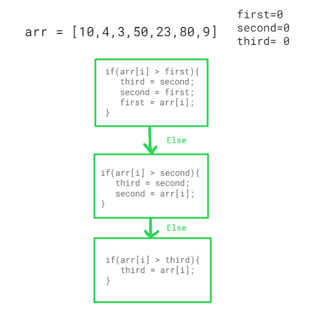
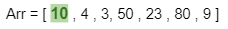
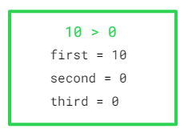
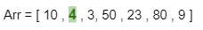
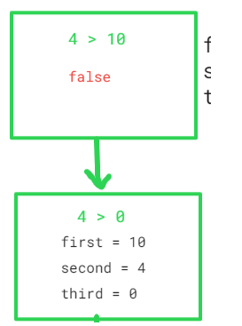
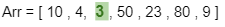

##### Greatest 3 Elements Ina Distinct Array , Difficulty - easy

***Explanation for the Approach***

arr = [10,4,3,50,23,80,9]

- Take first =0 , second 0, third = 0
- Iterate over the loop and run the following condition in the loop

- Let's start running the loop , with the following conditions

S.no | Element | array | condition run | consditions satisfied | Values
--- | --- | --- | --- |--- |--- 
arr[0] | 10 |  |  | first -  true, so will not go in the else part | first = 10, second = 0, third = 0
arr[1] | 4 |  |  | first - false, second - true, so will not go in the else part | first = 10, second = 4, third = 0
arr[2] | 3 |  |  | first - false, second - true , third - true | first = 10, second = 4, third = 3