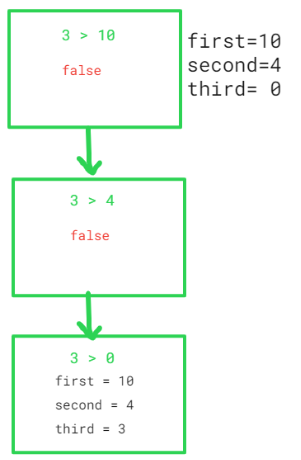
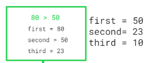

##### Greatest 3 Elements Ina Distinct Array , Difficulty - easy

***Approach 1 - using  partial sorting***

***Code***
```
function greatest3EleInDistinctArr(arr){
  //Using sorting
  arr.sort((a,b) => a-b);
  arr.reverse();
  return `first largest : ${arr[0]}, Second largest : ${arr[1]}, Third largest : ${arr[2]}`;
}

const arr = [10,4,30,50,23,80,9];
console.log(greatest3EleInDistinctArr(arr));
```

***Output***
```
- first largest : 80, Second largest : 50, Third largest : 30
```

***Complexity***
- ***Time Complexity*** - O(nlogm), where m is distance(middle-first).
- ***Space Complexity*** - O(1)

***Explanation for the Approach 3 - using Iteration***

arr = [10,4,3,50,23,80,9]

- Take first =0 , second 0, third = 0
- Iterate over the loop and run the following condition in the loop


- Let's start running the loop , with the following conditions

S.no | Element | array | condition run | consditions satisfied | Values
--- | --- | --- | --- |--- |--- 
arr[0] | 10 |  |  | first -  true, so will not go in the else part | first = 10, second = 0, third = 0
arr[1] | 4 |  |  | first - false, second - true, so will not go in the else part | first = 10, second = 4, third = 0
arr[2] | 3 |  |  | first - false, second - false , third - true | first = 10, second = 4, third = 3
arr[3] | 50 |  |  | first -  true, so will not go in the else part | first = 50, second = 10, third = 4
arr[4] | 23 |  |  |  first - false, second - true, so will not go in the else part | first = 50, second = 23, third = 10
arr[5] | 80 |  |  | first -  true, so will not go in the else part | first = 80, second = 50, third = 23
arr[6] | 9 |  |  | first - false, second - false , third - false = loop ends | first = 80, second = 50, third = 23

***Code***
```
function greatest3EleInDistinctArr(arr){
  let first = 0, second = 0, third= 0;
  
  for(let i = 0; i< arr.length; i++){
    if(arr[i] > first){
      third = second;
      second = first;
      first = arr[i];
    }
    else if(arr[i] > second){
      second = arr[i];
      third = second;
    }
    else if(arr[i] > third){
      third = arr[i];
    }
  }
  return `first largest : ${first}, Second largest : ${second}, Third largest : ${third}`;
}

const arr = [10,4,3,50,23,80,9];
console.log(greatest3EleInDistinctArr(arr));
```

***Output***
```
- first largest : 80, Second largest : 50, Third largest : 23
```

***Complexity***
- ***Time Complexity*** - O(n)
- ***Space Complexity*** - O(1)
