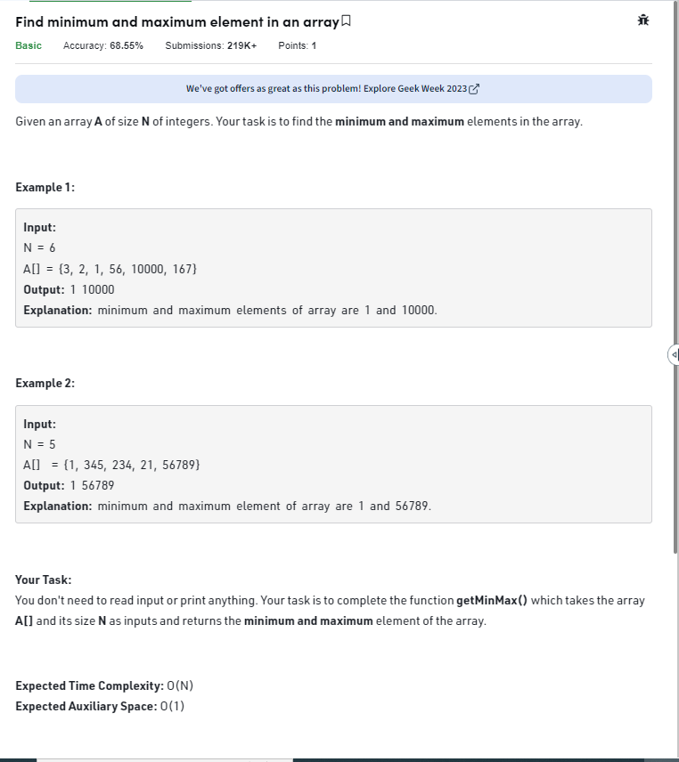
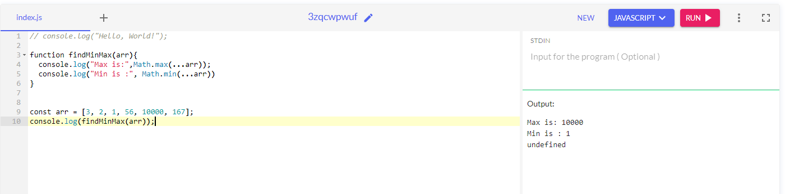
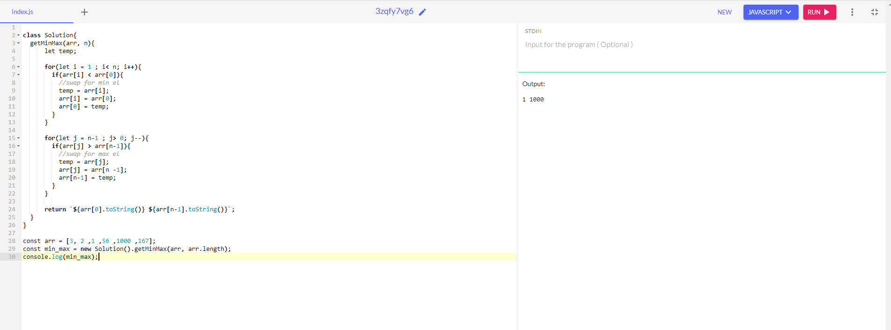

##### find the minimum and maximum elements in the array - difficulty - easy

Given an array A of size N of integers. Your task is to find the minimum and maximum elements in the array.

```
Example 1:

Input:
N = 6
A[] = {3, 2, 1, 56, 10000, 167}
Output: 1 10000
Explanation: minimum and maximum elements of array are 1 and 10000.
```

```
Example 2:

Input:
N = 5
A[]  = {1, 345, 234, 21, 56789}
Output: 1 56789
Explanation: minimum and maximum element of array are 1 and 56789.
```

Your Task:  
You don't need to read input or print anything. Your task is to complete the function getMinMax() which takes the array A[] and its size N as inputs and returns the minimum and maximum element of the array.

Expected Time Complexity: O(N)
Expected Auxiliary Space: O(1)



________________________________________________________________________________________________________

##### Solution 1

***Using Math function in js***

```
function findMinMax(arr){
  console.log("Max is:",Math.max(...arr));
  console.log("Min is :", Math.min(...arr))
}


const arr = [3, 2, 1, 56, 10000, 167];
console.log(findMinMax(arr));
```


____________________________________________________________________________________________________

##### Solution 2 - using for loop

***Code***

```
class Solution{
  getMinMax(arr, n){
      let temp;
      
      for(let i = 1 ; i< n; i++){
        if(arr[i] < arr[0]){
          //swap for min el
          temp = arr[i];
          arr[i] = arr[0];
          arr[0] = temp;
        }
      }
      
      for(let j = n-1 ; j> 0; j--){
        if(arr[j] > arr[n-1]){
          //swap for max el
          temp = arr[j];
          arr[j] = arr[n -1];
          arr[n-1] = temp;
        }
      }
          
      return `${arr[0].toString()} ${arr[n-1].toString()}`;
  }
}

const arr = [3, 2 ,1 ,56 ,1000 ,167];
const min_max = new Solution().getMinMax(arr, arr.length);
console.log(min_max);
```

***Output***


***Complexity***
- Time complexity - O(n)
- Space complexity - O(1)