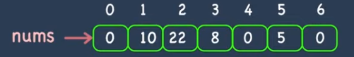
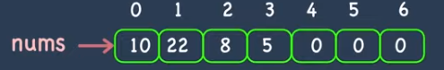
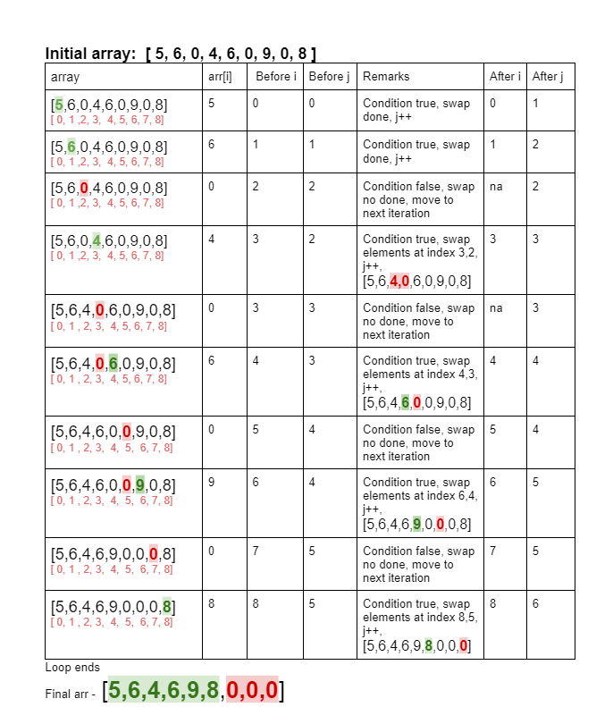

##### Leetcode 283. Move Zeroes

Given an integer array nums, move all 0's to the end of it while maintaining the relative order of the non-zero elements.

Note that you must do this in-place without making a copy of the array.

***Example 1:***

Input: nums = [0,1,0,3,12]
Output: [1,3,12,0,0]

***Example 2:***

Input: nums = [0]
Output: [0]
___________________________________________________________________________________

***Example***
##### Input

##### Output


____________________________________________________________________________________

***Approach 1: Partitioning the array***

Approach: The approach is pretty simple. We will use 0 as a pivot element and whenever we see a non zero element we will swap it with the pivot element. So all the non zero element will come at the beginning.

```
function pushZeroesToEnd(arr){
  let j = 0, temp;
  
  for(let i=0;i<arr.length ;i++){
    console.log("i:",i,"j:",j);
    if(arr[i] !=0){
      //swap arr[i] and arr[j]
      temp = arr[i];
      arr[i] = arr[j];
      arr[j] = temp;
      j++;
      console.log("i@@:",i,"j@@:",j)
    }
  }
  
  return arr;
}

const arr = [5,6,0,4,6,0,9,0,8];
console.log( pushZeroesToEnd(arr))
```

##### Explanation 


***Complexity***
- Time Complexity: O(N), where N is the size of elements of the input array.
- Auxiliary Space: O(1) 

