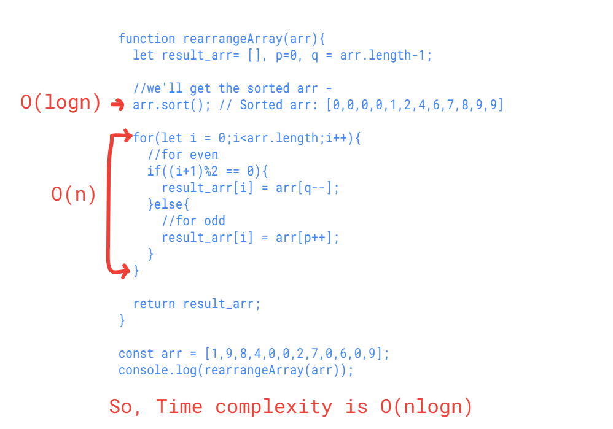

***Code***
```
// JavaScript program to rearrange the elements
// in array such that even positioned are
// greater than odd positioned elements
 
function rearrangeArray(arr){
  let result_arr= [], p=0, q = arr.length-1;
  
  //we'll get the sorted arr - 
  arr.sort(); // Sorted arr: [0,0,0,0,1,2,4,6,7,8,9,9]
  
  for(let i = 0;i<arr.length;i++){
    //for even
    if((i+1)%2 == 0){
      result_arr[i] = arr[q--];
    }else{
      //for odd
      result_arr[i] = arr[p++];
    }
  }
  
  return result_arr;
}

const arr = [1,9,8,4,0,0,2,7,0,6,0,9];
console.log(rearrangeArray(arr));
```

##### Output
- [ 0, 9, 0, 9, 0, 8, 0, 7, 1, 6, 2, 4 ]

##### Complexity


- ***Time Complexity*** - O(nlogn)
- ***Space Complexity*** - O(n) , As an extra array has been create to store the result.