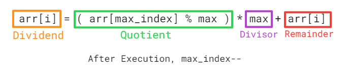
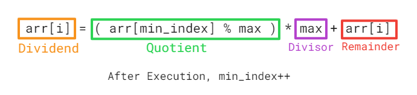
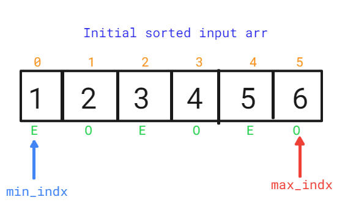
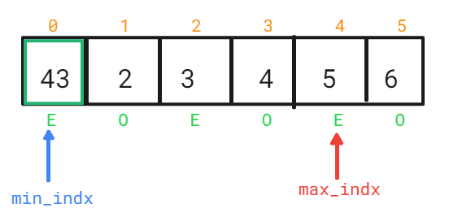
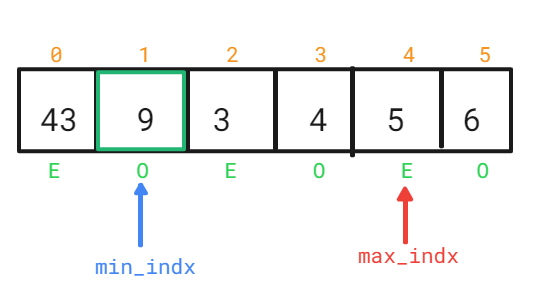
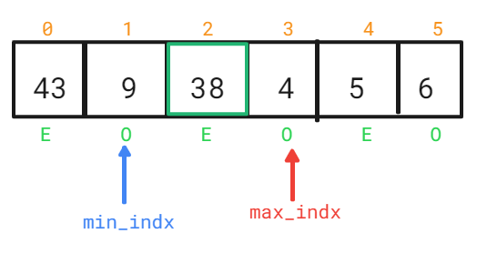
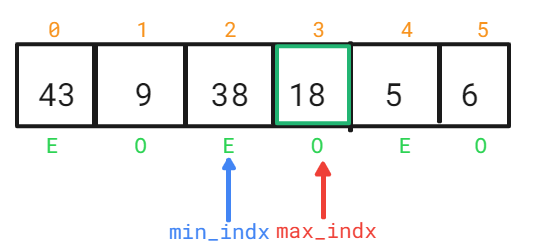
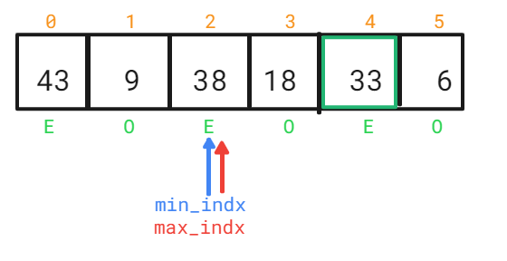
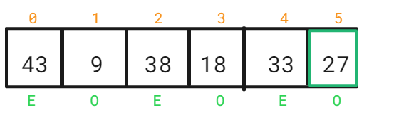
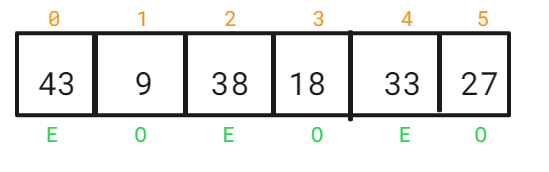

##### Rearrange an array in maximum minimum form using Two Pointer Technique 
***FAQ DSA problem - #Amazon..***

Given a sorted array of positive integers, rearrange the array alternately i.e first element should be a maximum value, at second position minimum value, at third position second max, at fourth position second min, and so on. 

Examples: 

Input: arr[] = {1, 2, 3, 4, 5, 6, 7} 
Output: arr[] = {7, 1, 6, 2, 5, 3, 4}

Input: arr[] = {1, 2, 3, 4, 5, 6} 
Output: arr[] = {6, 1, 5, 2, 4, 3} 

__________________________________________________________________________________

- Here we are using opposite directional pointers, one at the start and other at the end of the array.

***Code***
```
//rearrange max min in array using 2-pointer approach

function rearrangeMaxMin(arr){
  let start=0,end = arr.length-1, result_arr=[], isEndMoved = false;
  for(let i = 0;i<arr.length;i++){
    if(!isEndMoved){
      result_arr[i] = arr[end]
      isEndMoved = true;
      end--;
    }
    else{
      result_arr[i] = arr[start]
      isEndMoved = false;
      start++;
    }
  }
  return result_arr;
}

let arr = [1,2,3,4,5,6,7];
console.log(rearrangeMaxMin(arr));
```

***Output***
[ 7, 1, 6, 2, 5, 3, 4 ]

***Complexity***
- TC - O(n)
- SC - O(n), as an extra space is occupied for creating the new result_arr

##### Exercise: How to solve this problem if extra space is not allowed? 
```
***Expected Complexity***
- TC - O(n)
- SC - O(1)
```

By creating the new array, solving the problem was pretty simple , but now we need to solve the same problem using space O(1).


Here using swaping will be very difficult as , if we put 6 at 0th index, then we'll loose 1 that is on the 0th index , we need to put this 1 at the 1st index, so we cannot loose  1 that is on the 0th index, we need to keep track of both the old value to be replaced , also of the new value that would be replacing the old value.
 


- Points to notice 
- Here all the max elements are on the ***Even*** position 
- Here all the min elements are on the ***Odd*** position

***So here we want 2 values at a single place***


- Like here we want to bring 6 to the 0th index, and also keep a track of old value at 0th index that is 1.

- So for keep track of the old value and the new value at every index , we'll use the basic school formula.

***Dividend = Quotient * Divisor + Remainder***


***What we know for creating the modified array, so thet it can store the old and new value***
- We know the ***new value*** that needs to be inserted.
- We know the ***old value*** that is already present at that place.

***Approach***
Let us calculate few values
- max_index = n - 1, where n = arr.length
- min_index = 0

_____________ *** EVEN ***____________________________

Index % 2 == 0 , Even Index

- ***arr[i] = ( arr[max_index] % max ) * max + arr[i]***


_____________ *** ODD ***____________________________

Index % 2 != 0 , Odd Index

- ***arr[i] = ( arr[min_index] % max ) * max + arr[i]***


***Note*** 
- Here we have used Modulus (%), for storing, or keeping track of the old value.

- Let us calculate the value for ***max***, thet is used in the above formula
***max = arr[arr.length - 1] + 1***
- So here for arr = [1,2,3,4,5,6], value of max = 6 + 1 = 7, 

- Here we adding 1 to the maximumn value of the arr that is 6, because
- 5 % 6 = 5
- 4 % 6 = 4
- 3 % 6 = 3
- If we do x % y, where y > x, then we will get the x 
- As we are getting the same value we are adding 1 to the arr[arr.length-1] , this helps us to keep the track of the old value.

***Approach***


##### step 1
- i = 0 ( EVEN ) 
- ***arr[i] = ( arr[max_index] % max ) * max + arr[i]***, for even index
- arr[0] = ( 6 % 7 ) * 7 + 1 = 43
- Array after execution (1st iteration) 

- After 1st iteration, ***max_indx--***

##### step 2
- i = 1 ( ODD ) 
- ***arr[i] = ( arr[min_index] % max ) * max + arr[i]***
- arr[1] = ( 43 % 7 ) * 7 + 2 = 9
- Array after execution (2nd iteration)

- After 2nd iteration, ***min_indx++***

##### step 3
- i = 2 ( EVEN ) 
- ***arr[i] = ( arr[max_index] % max ) * max + arr[i]***, for even index
- arr[2] = ( 5 % 7 ) * 7 + 3 = 38
- Array after execution (3rd iteration) 

- After 3rd iteration, ***max_indx--***

##### step 4
- i = 3 ( ODD ) 
- ***arr[i] = ( arr[min_index] % max ) * max + arr[i]***
- arr[3] = ( 9 % 7 ) * 7 + 4 = 18
- Array after execution (4th iteration)

- After 4th iteration, ***min_indx++***

##### step 5
- i = 4 ( EVEN ) 
- ***arr[i] = ( arr[max_index] % max ) * max + arr[i]***, for even index
- arr[4] = ( 18 % 7 ) * 7 + 5 = 33
- Array after execution (5th iteration) 

- After 5th iteration, ***max_indx--***

##### step 6
- i = 5 ( ODD ) 
- ***arr[i] = ( arr[min_index] % max ) * max + arr[i]***
- arr[5] = ( 38 % 7 ) * 7 + 6 = 27
- Array after execution (6th iteration)

- After 6th iteration, ***min_indx++***

***loop ends here***
- so the final array we get here is 


- Now let us iterate over the loop, perform the follwing operation 
```
for (let i = 0; i < n; i++) {
  arr[i] = Math.floor(arr[i] / max_elem);
}
```

- Here, Finall after performing the above operation on each element in the array we get the desired ouput
***OUTPUT***
[ 6, 1, 5, 2, 4, 3 ] 

***Code***
```
// JavaScript program to rearrange an array in minimum 
// maximum form 
 
// Prints max at first position, min at second position 
// second max at third position, second min at fourth 
// position and so on. 
function rearrange(arr, n) 
{ 
    // initialize index of first minimum and first 
    // maximum element 
    let max_idx = n - 1, min_idx = 0; 
 
    // store maximum element of array 
    let max_elem = arr[n - 1] + 1; 
 
    // traverse array elements 
    for (let i = 0; i < n; i++) { 
        // at even index : we have to put maximum element 
        if (i % 2 == 0) { 
            arr[i] += (arr[max_idx] % max_elem) * max_elem; 
            max_idx--;
            console.log("EVEN , i:", i, "max_idx:", max_idx);
        } 
 
        // at odd index : we have to put minimum element 
        else { 
            arr[i] += (arr[min_idx] % max_elem) * max_elem; 
            min_idx++; 
            console.log("ODD , i:", i, "min_idx:", min_idx);
        } 
    } 
  
    console.log("nayi array:", arr);
 
    // array elements back to it's original form 
    for (let i = 0; i < n; i++) 
        arr[i] = Math.floor(arr[i] / max_elem); 
        
    return arr;
} 
 
// Driver program to test above function 
 
    let arr = [ 1, 2, 3, 4, 5, 6 ]; 
    let n = arr.length; 
 
    
 
    console.log("Modified Array:",rearrange(arr, n));
```

***Complexity***
- TC - O(n)
- SC - O(1)