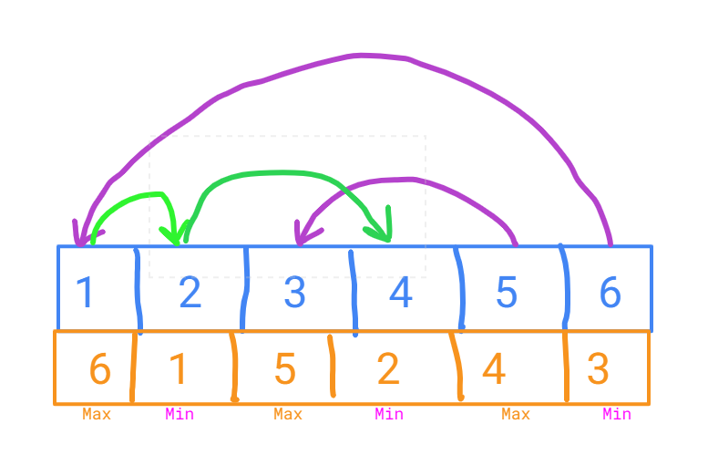
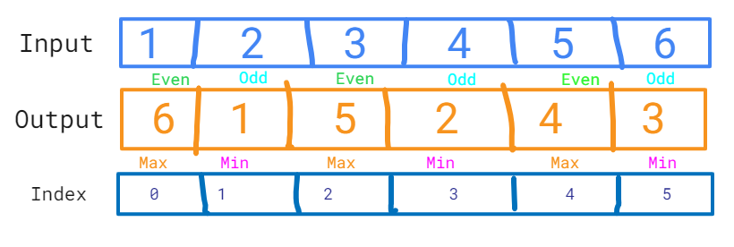
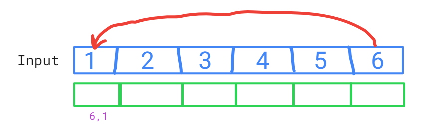
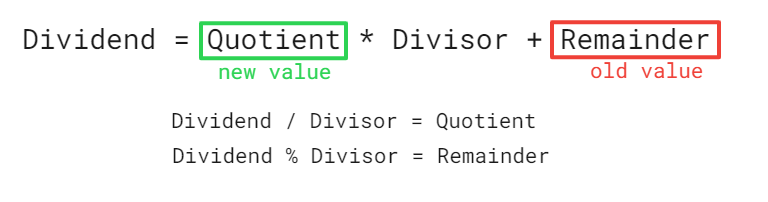

##### Rearrange an array in maximum minimum form using Two Pointer Technique 
***#Amazon***

Given a sorted array of positive integers, rearrange the array alternately i.e first element should be a maximum value, at second position minimum value, at third position second max, at fourth position second min, and so on. 

Examples: 

Input: arr[] = {1, 2, 3, 4, 5, 6, 7} 
Output: arr[] = {7, 1, 6, 2, 5, 3, 4}

Input: arr[] = {1, 2, 3, 4, 5, 6} 
Output: arr[] = {6, 1, 5, 2, 4, 3} 

__________________________________________________________________________________

- Here we are using opposite directional pointers, one at the start and other at the end of the array.

***Code***
```
//rearrange max min in array using 2-pointer approach

function rearrangeMaxMin(arr){
  let start=0,end = arr.length-1, result_arr=[], isEndMoved = false;
  for(let i = 0;i<arr.length;i++){
    if(!isEndMoved){
      result_arr[i] = arr[end]
      isEndMoved = true;
      end--;
    }
    else{
      result_arr[i] = arr[start]
      isEndMoved = false;
      start++;
    }
  }
  return result_arr;
}

let arr = [1,2,3,4,5,6,7];
console.log(rearrangeMaxMin(arr));
```

***Output***
[ 7, 1, 6, 2, 5, 3, 4 ]

***Complexity***
- TC - O(n)
- SC - O(n), as an extra space is occupied for creating the new result_arr

##### Exercise: How to solve this problem if extra space is not allowed? 
```
***Expected Complexity***
- TC - O(n)
- SC - O(1)
```

By creating the new array, solving the problem was pretty simple , but now we need to solve the same problem using space O(1).



Here using swaping will be very difficult as , if we put 6 at 0th index, then we'll loose 1 that is on the 0th index , we need to put this 1 at the 1st index, so we cannot loose  1 that is on the 0th index, we need to keep track of both the old value to be replaced , also of the new value that would be replacing the old value.
 


- Points to notice 
- Here all the max elements are on the ***Even*** position 
- Here all the min elements are on the ***Odd*** position

***So here we want 2 values at a single place***



- Like here we want to bring 6 to the 0th index, and also keep a track of old value at 0th index that is 1.

- So for keep track of the old value and the new value at every index , we'll use the basic school formula.

***Dividend = Quotient * Divisor + Remainder***



***What we know for creating the modified array, so thet it can store the old and new value***
- We know the ***new value*** that needs to be inserted.
- We know the ***old value*** that is already present at that place.

***Approach***
Let us calculate few values
- max_index = n - 1, where n = arr.length
- min_index = 0

_____________ *** EVEN ***____________________________

_____________ *** ODD ***____________________________