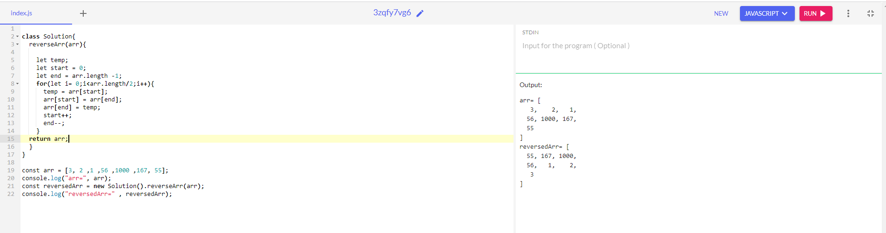

##### Reverse an array - array basic que

##### solution 1 - using iterative approach

***Code***
```
class Solution{
  reverseArr(arr){
    
    let temp;
    let start = 0;
    let end = arr.length -1;
    for(let i= 0;i<arr.length/2;i++){
      temp = arr[start];
      arr[start] = arr[end];
      arr[end] = temp;
      start++;
      end--;
    }
  return arr;
  }
}

const arr = [3, 2 ,1 ,56 ,1000 ,167, 55];
console.log("arr=", arr);
const reversedArr = new Solution().reverseArr(arr);
console.log("reversedArr=" , reversedArr);
```

***Output***


