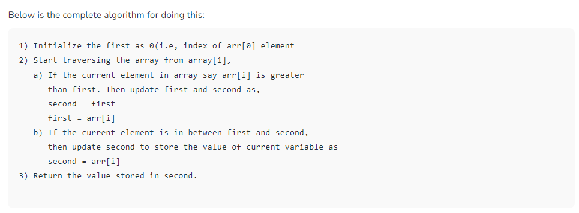

##### Find Second largest element in an array

Given an array of integers, our task is to write a program that efficiently finds the second-largest element present in the array. 


Example:
```
Input: arr[] = {12, 35, 1, 10, 34, 1}
Output: The second largest element is 34.
Explanation: The largest element of the 
array is 35 and the second 
largest element is 34
Input: arr[] = {10, 5, 10}
Output: The second largest element is 5.
Explanation: The largest element of 
the array is 10 and the second 
largest element is 5
Input: arr[] = {10, 10, 10}
Output: The second largest does not exist.
Explanation: Largest element of the array 
is 10 there is no second largest element
```

***Approach 2: Efficient approach***

***Finding the second largest element in a single traversal.***
- 

```
function largestSecondElement(arr){
  let first= 0, second=0;
  
  for(let i=0;i<arr.length;i++){
    if(arr[i]> first){
      second = first;
      first=arr[i];
    }
    else if(arr[i]> second){
      second = arr[i];
    }
  }
 
  return `Second largest element in the array is : ${second}`;
}

const arr = [10,4,30,50,23,80,9];
console.log(largestSecondElement(arr));
```

***Output***
- Second largest element in the array is : 50

***Complexity***
- Time Complexity: O(n). 
  - Only one traversal of the array is needed.
- Auxiliary space: O(1). 
  - As no extra space is required.
