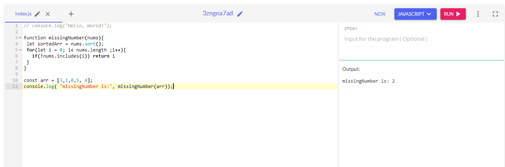
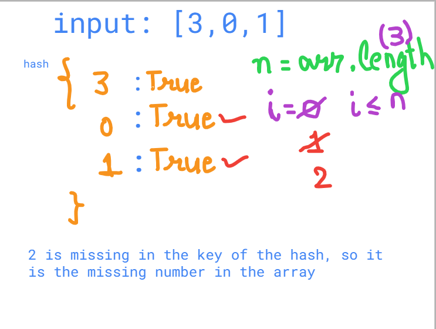
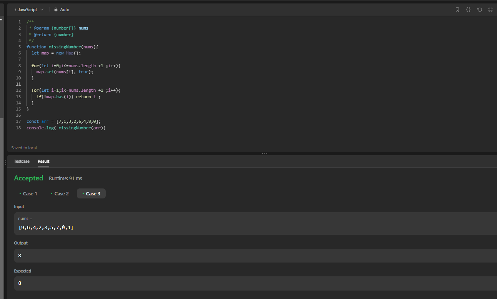
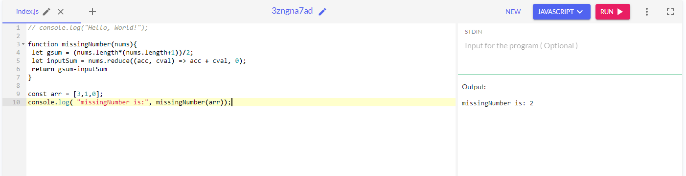

### Missing number in an array - leetcode 268

##### Given an array nums containing n distinct numbers in the range [0, n], return the only number in the range that is missing from the array. 

***Example 1:***
```
Input: nums = [3,0,1]
Output: 2
Explanation: n = 3 since there are 3 numbers, so all numbers are in the range [0,3]. 2 is the missing number in the range since it does not appear in nums.
Example 2:

Input: nums = [0,1]
Output: 2
Explanation: n = 2 since there are 2 numbers, so all numbers are in the range [0,2]. 2 is the missing number in the range since it does not appear in nums.
Example 3:

Input: nums = [9,6,4,2,3,5,7,0,1]
Output: 8
Explanation: n = 9 since there are 9 numbers, so all numbers are in the range [0,9]. 8 is the missing number in the range since it does not appear in nums.
 

Constraints:

n == nums.length
1 <= n <= 104
0 <= nums[i] <= n
All the numbers of nums are unique.
```

***Follow up: Could you implement a solution using only O(1) extra space complexity and O(n) runtime complexity?***

- There are 3 approaches of solving this problem
_____________________________________________________

***Solution 1 - using Sorting***

***Approach***
- So here we have input of nums = [3,0,1]
- Here we can use ***sorting***, so sorted array will be [0,1,3]
- Then we can so a linear scan on the sorted array, and then figure out the missing number

***Code***
```
function missingNumber(nums){
 let sortedArr = nums.sort();
 for(let i = 0; i< nums.length ;i++){
   if(!nums.includes(i)) return i
 }
}

const arr = [3,1,0,5, 4];
console.log( "missingNumber is:", missingNumber(arr));
```
***output***


***Complexity***
- Time complexity - 0(nlogn)
- space complexity - O(1)
___________________________________________________________________

***Solution 2 - using Hashing***

***Approach***
- Create a hash
```
{ 3 => true, 1 => true, 0 => true }
```
- Now we can iterate over the array, can then we can check that num of the array is that key in the hash



***Complexity***
- Time complexity - 0(n) - linear time
- space complexity - O(n) - linear space with this hash

```
function missingNumber(nums){
  let map = new Map();
  
  for(let i=0;i<=nums.length ;i++){
    map.set(nums[i], true);
  }
  
  console.log(map);
  for(let i=0;i<=nums.length ;i++){
    if(!map.has(i)) return i ;
  }
}

const arr = [7,1,3,2,6,4,8,0];
console.log( missingNumber(arr))
```
***output***


***So here are the two brute force ways we can solve this, in these 2 ways we can either optimize for space or optimize for time***

***Now we need to find a way where we can solve this using Linear time and constant space***

___________________________________________________________________

***Solution 3 - using algorithm***

***Approach***
- Here we will use a formula to get the sum of all the numbers from 0 to array length
- Formula ***gsum = n * (n+1) / 2***
- so here gsum is 6
- Now we can use reduce to calculate the sum of the input array, which is 4.
- Then can calculate missing number = gsum - sum of the input array

***Code***
```
function missingNumber(nums){
 let gsum = (nums.length*(nums.length+1))/2;
 let inputSum = nums.reduce((acc, cval) => acc + cval, 0);
 return gsum-inputSum
}

const arr = [3,1,0];
console.log( "missingNumber is:", missingNumber(arr));
```

***output***


***Complexity***
- Time complexity - 0(n) - linear time
- space complexity - O(1) - As we are creating no new space so here we are creting space for sum of the input array(4) and the gsum, so it going to constant regardless of the size of the input, so we have constant space for this solution


