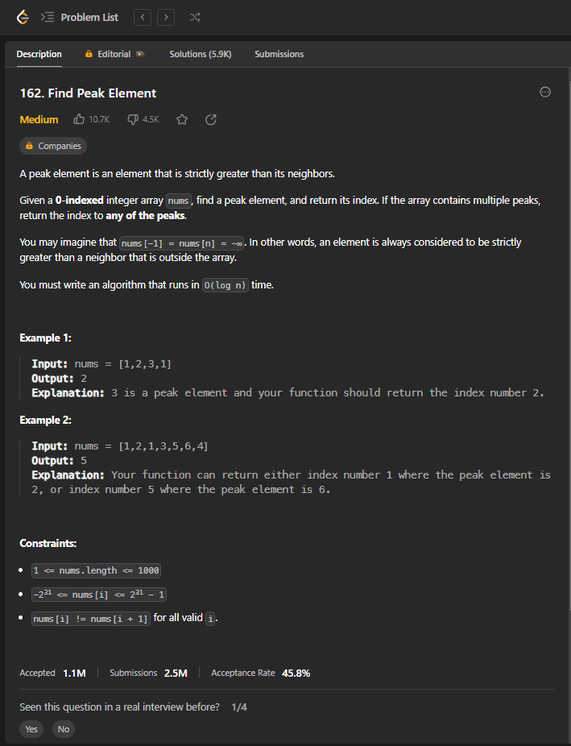
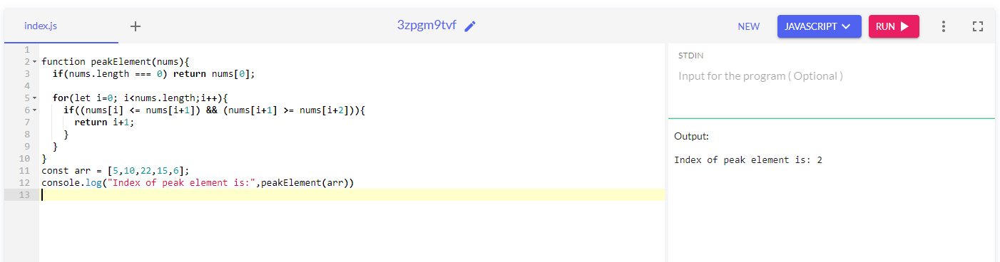

##### Leetcode - 162 - Difficulty - medium
##### Find a peak element which is not smaller than its neighbours

A peak element is an element that is strictly greater than its neighbors.

Given a 0-indexed integer array nums, find a peak element, and return its index. If the array contains multiple peaks, return the index to any of the peaks.

You may imagine that nums[-1] = nums[n] = -∞. In other words, an element is always considered to be strictly greater than a neighbor that is outside the array.

You must write an algorithm that runs in O(log n) time.

 

Example 1:

Input: nums = [1,2,3,1]
Output: 2
Explanation: 3 is a peak element and your function should return the index number 2.
Example 2:

Input: nums = [1,2,1,3,5,6,4]
Output: 5
Explanation: Your function can return either index number 1 where the peak element is 2, or index number 5 where the peak element is 6.



***solution 1***
```
function peakElement(nums){
  if(nums.length === 0) return nums[0];
  
  for(let i=0; i<nums.length;i++){
    if((nums[i] <= nums[i+1]) && (nums[i+1] >= nums[i+2])){
      return i+1;
    }
  }
}
const arr = [5,10,22,15,6];
console.log("Index of peak element is:",peakElement(arr))
```

***Output - ss***
Index of peak element is: 2


***Complexity***
- Time complexity: O(n), One traversal is needed so the time complexity is O(n)
- Auxiliary Space: O(1), No extra space is needed, so space complexity is constant