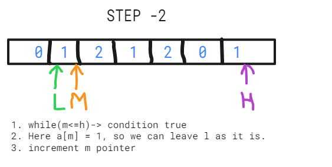

##### Leetcode - 75 - Difficulty - medium
##### Sort an array of 0s, 1s and 2s | Dutch National Flag problem

Given an array A[] consisting of only 0s, 1s, and 2s. The task is to write a function that sorts the given array. The functions should put all 0s first, then all 1s and all 2s in last.

This problem is also the same as the famous “Dutch National Flag problem”. The problem was proposed by Edsger Dijkstra. The problem is as follows:

***Given N balls of colour red, white or blue arranged in a line in random order. You have to arrange all the balls such that the balls with the same colours are adjacent with the order of the balls, with the order of the colours being red, white and blue (i.e., all red coloured balls come first then the white coloured balls and then the blue coloured balls).*** 

- Examples:
- Input: {0, 1, 2, 0, 1, 2}
- Output: {0, 0, 1, 1, 2, 2}

- Input: {0, 1, 1, 0, 1, 2, 1, 2, 0, 0, 0, 1}
- Output: {0, 0, 0, 0, 0, 1, 1, 1, 1, 1, 2, 2}

- 
________________________________________________________________

***Solution 1 - using sorting***

- Here we can sort it using the sort method of an array.

***Code***
```
function sortZeroOneTwo(nums){
  return nums.sort((a,b) => a-b);
}

const arr = [0,1,2,1,1,0,0,2,0,1];
console.log( "sortZeroOneTwo is:", sortZeroOneTwo(arr));
```
***Output***


***Complexity***
- Time Complexity - O(nlogn)
- Space Complexity - O(n)

- When we talk about sorting the time complexity is nlogn for the worst case, now we'll try to solve it using o(n) time complexity
________________________________________________________________________________

***Solution 2 - Better approach***
- This array contains 0,1,2
- Here we'll do a single iteration , and we'll keep 3 variables count_0, count_1, count_2
- So whenever we encounter a specific number , we'll increase its count.


***Code***
```
function sortZeroOneTwo(nums){
  let count_0 = 0 , count_1 = 0, count_2 = 0;
  
  for(let i =0 ; i<nums.length; i++){
    if(nums[i] == 0){
      count_0++;
    }else if(nums[i] == 1){
      count_1++;
    }else{
      count_2++;
    } 
  }
  
  console.log('count_0:', count_0, 'count_1:', count_1 , 'count_2:', count_2);
  for(let i =0;i<count_0; i++){
    nums[i] = 0;
  }
  for(let i =count_0;i<count_0+count_1; i++){
    nums[i] = 1;
  }
  for(let i =count_0+count_1;i<count_0+count_1+count_2; i++){
    nums[i] = 2;
  }
  return nums
}

const arr = [0,1,2,1,1,0,0,2,0,1];
console.log( "sortZeroOneTwo is:", sortZeroOneTwo(arr));
```

***Output***

 

***Complexity***


- Here the Time complexity will become O(2n), as explained above.

- Time Complexity - O(2n) - Here if we transverse the whole array ot transverse the array in parts the total time complexity is summation of O(n)
- Space Complexity - O(1), as we are not using any extra space.

________________________________________________________________________________

***Solution 3 - Optimal approach - using pointers***

***Explanation***


##### Simple steps to follow for this sorting

1. If we encounter a[m] == 0, that is m encounters a zero, then we swap elements at l and m pointers position, and then increment both l and m pointers.
2. If we encounter a[m] == 1, that is m encounters a one, then leave the elment at m as it is, and then increment m pointer.
3. If we encounter a[m] == 2, that is m encounters a two, then we swap elements at h and m pointers position, and then decrement h pointer, , m pointer will remain as it is , it will not get incremented because m pointers is getting a new element, that will be coming from right hand side of the array
4. Now The new element at m pointer is checked and the action is taken accordingly. 

***example 1***
- let's understand the pointer approach using example
- input arr = [0,1,2,1,2,0,1]

##### Step 1


##### Step 2


##### Step 3


##### Step 4


##### Step 5


##### Step 6


##### Step 7


##### Step 8


##### Step 9


##### Code
```
/**
 * @param {number[]} nums
 * @return {void} Do not return anything, modify nums in-place instead.
 */
var sortColors = function(nums) {
    let n = nums.length;
    let l = 0, m = 0, h = n - 1;
    let temp = 0;

    while(m<=h){
      //Ecounters ZERO
      if(nums[m] == 0){
        //swap l and m
        temp = nums[m];
        nums[m] = nums[l];
        nums[l]= temp;
        //increment l and m pointers
        l++;
        m++
      }
      //Ecounters ONE
      else if(nums[m] == 1){
        //leave element at l pointer as it is and increment m pointer
        m++;
      }
      //Ecounters TWO
      else 
      {
        //swap m and h
        temp = nums[m];
        nums[m] = nums[h];
        nums[h] = temp;
        //decrement h pointer
        h--;
      }
    }
    // console.log('sorted arr:', nums);
  return nums;
};

let arr= [0, 1, 1, 0, 1, 2, 1, 2, 0, 0, 0, 1 ];
console.log("sorted colors:",sortColors(arr) )
```

##### Output


***Complexity***
Time Complexity: O(n), Only one traversal of the array is needed.
Space Complexity: O(1), No extra space is required.

__________________________________________________________________________________________________________________________

- This Que has been asked in various companies like - 
Paytm
Flipkart
Morgan Stanley
Amazon
Microsoft
OYO Rooms
Samsung
Snapdeal
Hike
MakeMyTrip
Ola Cabs
Walmart
MAQ Software
Adobe
Yatra.com
SAP Labs
Qualcomm