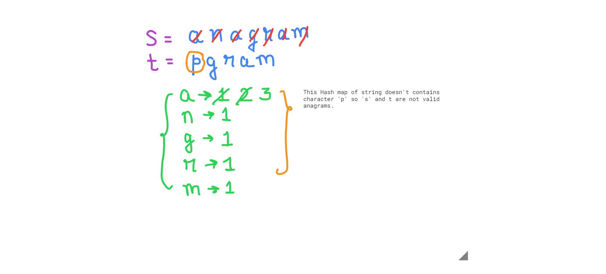
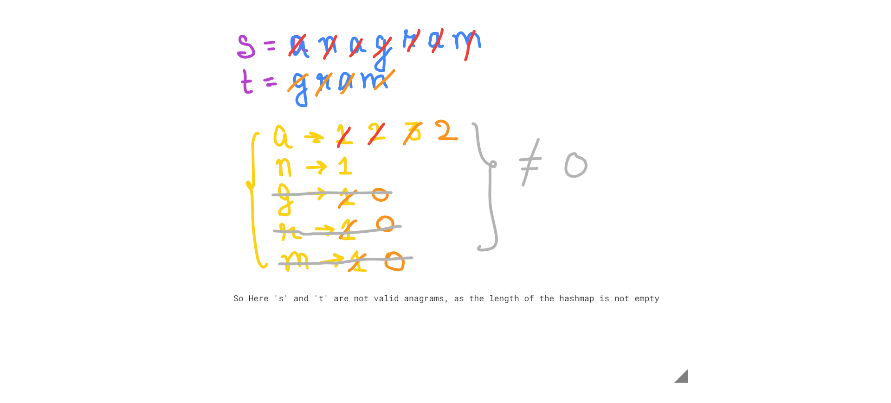

#### Valid Anagram - leetcode problem no 242

- An anagram is a phrase/word formed by rearranging the lettersthe letters of a different word or phrase, typically using all the original letters exactly once

```
Example 1:

Input: s = "anagram", t = "nagaram"
Output: true

Example 2:

Input: s = "rat", t = "car"
Output: false
```

***Solution 1:***
- simple one liner solution

1. s= 'anagram'
2. t= 'nagaram'
*** Algorithm ***
3. Take first 's' string  -> convert it into array -> sort the array -> again convert it into string.
4. Repeat the same step 3 with string 't'.
5. If Both the sorted strings 's' and 't' are equal, then they are valid anagrams, otherwise they are not valid anagrams 

***Code***
```
var isAnagram = function(s, t) {
    return s.split('').sort().join('') === t.split('').sort().join('')
};

console.log("isAnagram:", isAnagram("anagram","nagaram"))
```
***output***
```
Output:

isAnagram: true
```

***Complexity***
- Time complexity:
- O(n) - We iterate over the array once.
- Space complexity:
- O(n) 

***solution 2***
- This is a better an a precise solution of the above problem using hash map.

***Example 1***
- s = 'anagram'
- t = 'nagaram' 

.png>)

***Example 2***
- s = 'anagram'
- t = 'pgram' 



***Example 3***
- s = 'anagram'
- t = 'gram' 



***Explanation***
1. Firstly we need to check if length of both strings, if s.length !== t.length, then we will directly return false, as they are not valid anagrams
```
if(s.length !== t.length) return false
```

2. Now, If length of both the s and t string are equal then we need to check the occourances.
   - for eg. -> count of character 'a' in string 's' and string 't' , should be equal.
   - Similarly we need to do it for all the characters found.
   - For checking the ocoourances and maintaining the count of each and every chararcter in the string , we'll create a map
   - After creating the hashmap, we'll iterate over the characters of the first string 's'
   - Now, if we have encounterd the ch of string 's', that was already there in the hashmap, then we increment its occourance value in the hashmap by one
   - Incase we have encounterd the ch of string 's' for the first time then we'll set its coourance value 1 in the hashmap
```
const map = new Map();
for (const c of s){
    if(map.has(c)) map.set(c, map.get(c) + 1)
    else map.set(c, 1);
}
```

3. Now , we are going to iterate over the character of the string 't'
   - Now, if we have encounterd the ch of string 't', if the particular character is not there in the hashmap, then we'll return false, as 's' and 't' , both are not valid anagrams
   - Now, if we have encounterd the ch of string 't', that was already there in the hashmap, then we'll decrement its occourance value in the hashmap by one
   - And On decrementing the final occurance value becomes zero, then we'll delete that particular character from the hashmap

```
for (const c of t){
    if(!map.has(c)) return false;
    map.set(c , map.get(c) - 1);
    if(map.get(c) === 0) map.delete(c)
}
```

4. Now After iterating over the string 's' and 't' , if the size of the map is greater than zero, then we can return zero as they are not the valid anagrams
```
if(map.size > 0) return false;
```

5. And Then finally return true, if the above condition is not satisfied, So if the above condition is not satisfied then string 's' and 't' are valid anagrams

```
var isAnagram = function(s, t) {
    // return s.split('').sort().join('') === t.split('').sort().join('')
    if(s.length !== t.length) return false;
    const map = new Map();
    for(const c of s){
        if(map.has(c)) map.set(c, map.get(c) + 1)
        else map.set(c, 1)
    }

    for(const c of t){
        if(!map.has(c)) return false;
        map.set(c, map.get(c) - 1);
        if(map.get(c) === 0) map.delete(c);
    }
    if(map.size > 0) return false;

    return true;
};

console.log("isAnagram:", isAnagram("anagram","pgaram"));
```


