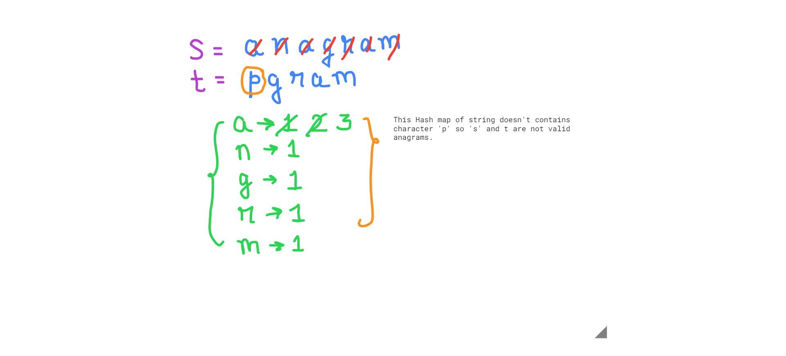
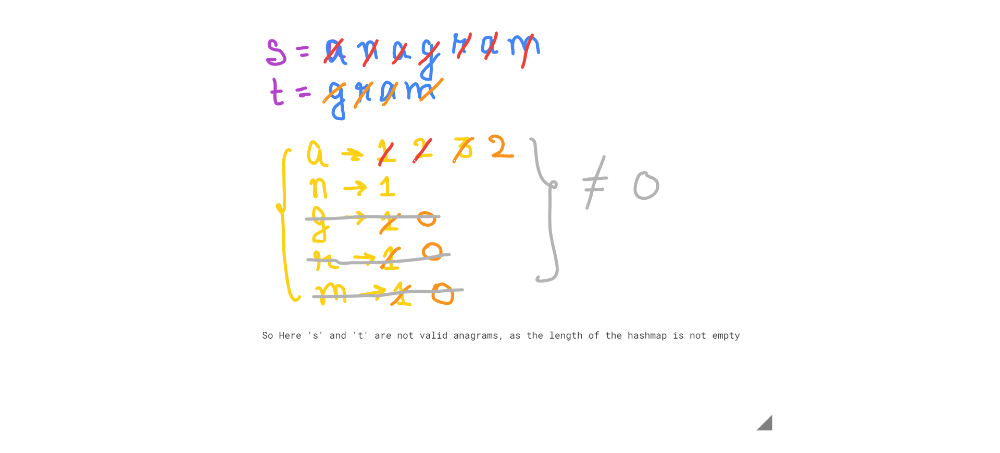

#### Valid Anagram - leetcode problem no 242

- An anagram is a phrase/word formed by rearranging the lettersthe letters of a different word or phrase, typically using all the original letters exactly once

```
Example 1:

Input: s = "anagram", t = "nagaram"
Output: true

Example 2:

Input: s = "rat", t = "car"
Output: false
```

***Solution 1:***
- simple one liner solution

1. s= 'anagram'
2. t= 'nagaram'
*** Algorithm ***
3. Take first 's' string  -> convert it into array -> sort the array -> again convert it into string.
4. Repeat the same step 3 with string 't'.
5. If Both the sorted strings 's' and 't' are equal, then they are valid anagrams, otherwise they are not valid anagrams 

***Code***
```
var isAnagram = function(s, t) {
    return s.split('').sort().join('') === t.split('').sort().join('')
};

console.log("isAnagram:", isAnagram("anagram","nagaram"))
```
***output***
```
Output:

isAnagram: true
```

***Complexity***
- Time complexity:
- O(n) - We iterate over the array once.
- Space complexity:
- O(n) 

***solution 2***
- This is a better an a precise solution of the above problem using hash map.

***Explanation***
- s = 'anagram'
- t = 'nagaram' 

.png>)

***Algorithm***
*** Example 2 ***
- s = 'anagram'
- t = 'pgram' 



*** Example 3 ***
- s = 'anagram'
- t = 'gram' 



*** Algorithm ***


