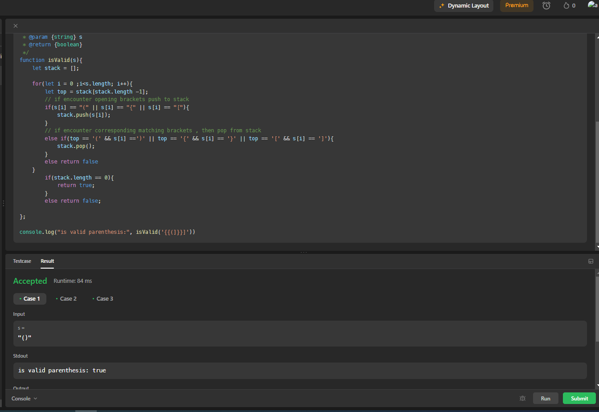
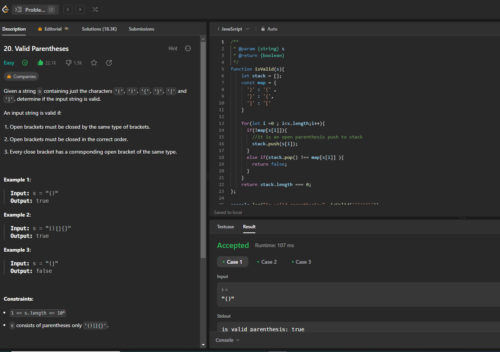

#### Valid Parentheses - leetcode problem no 20 - Difficulty easy

- Given a string s containing just the characters '(', ')', '{', '}', '[' and ']', determine if the input string is valid.

An input string is valid if:

- Open brackets must be closed by the same type of brackets.
- Open brackets must be closed in the correct order.
- Every close bracket has a corresponding open bracket of the same type.
 
```
Example 1:

Input: s = "()"
Output: true
Example 2:

Input: s = "()[]{}"
Output: true
Example 3:

Input: s = "(]"
Output: false

```
***Que Explanation***
- The question basically asks us to look at a string and determine whether or not it has valid parentheses. This means that each parenthesis, bracket, or brace has a matching pair. For example, the string “( )” would be a valid pair, while the string “([)]” would not be a valid pair.

- You may think that the best approach may be to use a hashmap, but the best way to approach this problem is actually to use a stack. What we’ll do is we will process each character in the string and when we find an open parenthesis we will push it onto the stack. Then when we see a closed parenthesis we check if it’s the same type as the parenthesis on our stack, and if it is we pop it off the stack. If this is a little confusing hopefully taking a glance at the code will help make it more clear.

***Solution 1:*** 
- Brute force approach
- Here we are going to use stack implementation of array.

***Approach***
This is a simple question 😃. We will traverse the string s from left to right and see if left and right parentheses are matching with their corresponding counterpart.
1. Traverse the string from left to right.
2. If we encounter the open/left parenthesis, then we will push it to the Stack data structure due to its Last In First Out (LIFO) property.
3. If we encounter any of the close/right parentheses, we will check it with the top of the stack. If it is the correct corresponding open/left parenthesis, we will move further, else we will return false.
4. At last, for valid string, the stack should be empty because all the left parentheses should have matched with the right ones.

***Code***
```
/**
 * @param {string} s
 * @return {boolean}
 */
function isValid(s){
    let stack = [];

    for(let i = 0 ;i<s.length; i++){
        let top = stack[stack.length -1];
        // if encounter opening brackets push to stack
        if(s[i] == "(" || s[i] == "{" || s[i] == "["){
            stack.push(s[i]);
        }
        // if encounter corresponding matching brackets , then pop from stack
        else if(top == '(' && s[i] ==')' || top == '{' && s[i] == '}' || top == '[' && s[i] == ']'){
            stack.pop();
        }
        else return false
    }
        if(stack.length == 0){
            return true;
        }
        else return false;

};

console.log("is valid parenthesis:", isValid('{{(]}}]'))
```
***output***


***Complexity***
- Time complexity:
- We are traversing the string once, hence the time complexity will be O(n).
- Space complexity:
- We are using Stack to store characters of the string, hence the space complexity will be O(n).

 

***solution 2***
- Valid Parentheses - Javascript - using stack and hashmap

***Approach***
1. Create an empty stack.
2. Create a hashmap for the matching brackets
```
const map = {
        '(': ')',
        '{': '}',
        '[': ']',
    };
```
3. Now we'll loop over the entire string.Then we will check to see if the character is an open parenthesis by making sure it is not a key in our hashmap. After that we know it is an open parenthesis, so we can now push it onto our stack.
```
if (map[s[i]]) {
    stack.push(s[i]);
} 
```
4. If it is a closed parenthesis we can take the open one off of our stack and see if it is of the same type. If it isn’t we return false, otherwise we go through the rest of the string.
```
else if(stack.pop() !== map[s[i]] ){
    return false;
}
```

***Code***
```
/**
 * @param {string} s
 * @return {boolean}
 */
function isValid(s){
    let stack = [];
    const map = {
      ')' : '(' ,
      '}' : '{',
      ']' : '['
    }
    
    for(let i =0 ; i<s.length;i++){
      if(!map[s[i]]){
        //it is an open parenthesis push to stack
        stack.push(s[i]);
      }
      else if(stack.pop() !== map[s[i]] ){
        return false;
      }
    }
    return stack.length === 0;
};

console.log("is valid parenthesis:", isValid('{{()}}'))
```

***output***
- is valid parenthesis: true

***Time complexity:***
- We are traversing the string once, hence the time complexity will be O(n).
- Space complexity:
- space complexity will be O(1).



